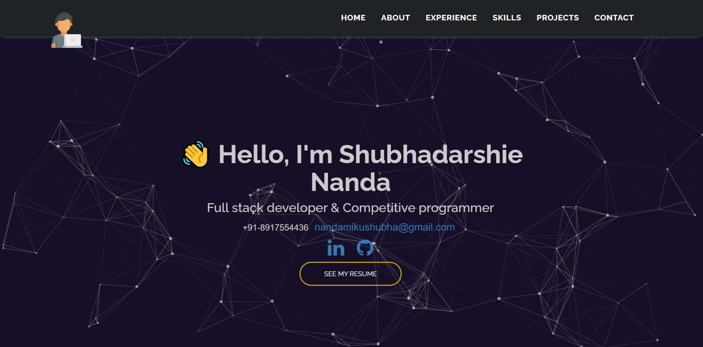

# Portfolio

Personal portfoilo.
# ShubhaN

See the [demo](https://shubha-portfolio.herokuapp.com/) here




Some basic Git commands are:

```
$ git clone https://github.com/mohamedsamara/mern-ecommerce.git
$ cd project
$ npm install

```
## Setup

```
> Create .env file that include:
  * API_KEY => api key from sendgrid

```

## Run the application for development

```
$ npm start

```
